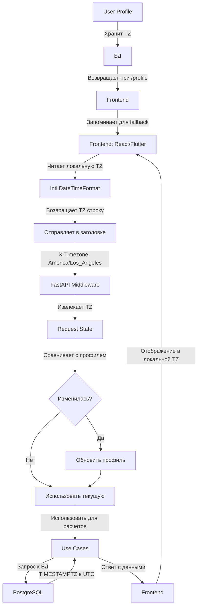
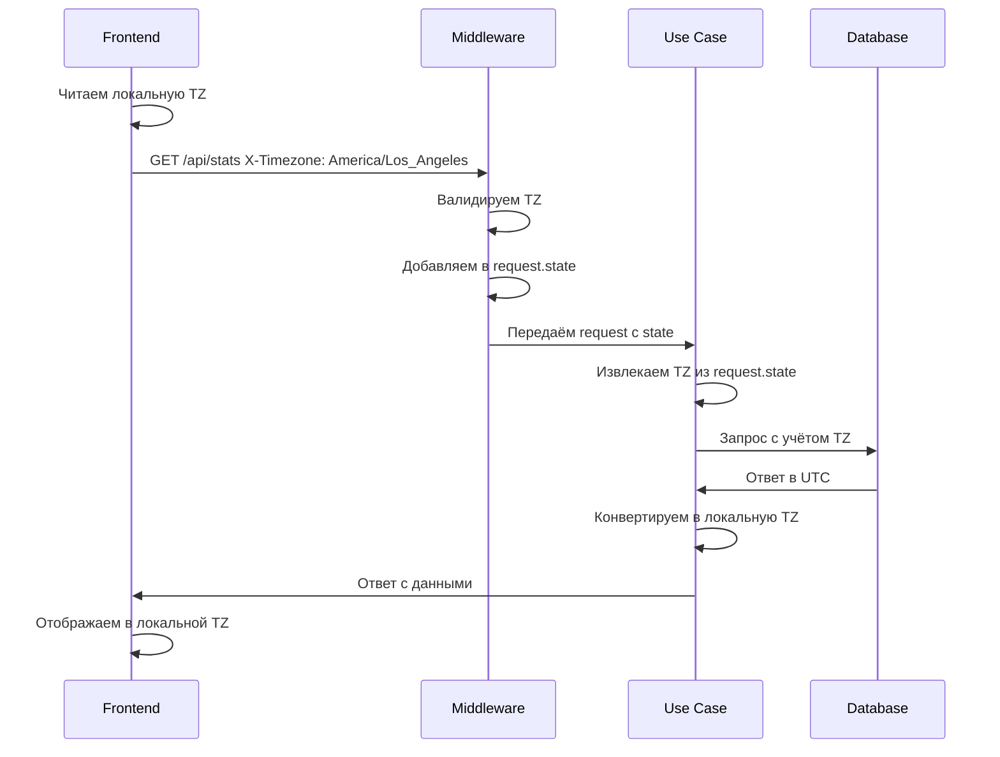

# План миграции на поддержку таймзон пользователей

## 1. Обзор текущей проблемы

Весь код использует `datetime.now(timezone.utc)` для определения "сегодняшнего дня", что приводит к некорректному поведению для пользователей в разных часовых поясах:

- **Проблема 1**: Прогноз повторений для пользователя в California (UTC-7) будет показывать "завтра" когда для Москвы это ещё "сегодня"
- **Проблема 2**: Методы `func.date()` в PostgreSQL зависят от таймзоны сессии сервера
- **Проблема 3**: Study cutoff (3 ночи) работает в UTC, а не в локальной таймзоне пользователя

---

## 2. Архитектура передачи таймзоны

### 2.1. Как фронтенд отправляет таймзону

**Простой способ**: Заголовок `X-Timezone` при каждом запросе

```
Frontend (React/Flutter/Mobile)
      |
      | 1. Читает локальную таймзону устройства:
      |    Intl.DateTimeFormat().resolvedOptions().timeZone
      | 2. Отправляет в заголовке:
      |    X-Timezone: "America/Los_Angeles"
      v
Backend (FastAPI)
```

### 2.2. Нужно ли отслеживать изменения?

**Да, но просто**:

1. **При каждом запросе**: фронтенд отправляет `X-Timezone` заголовок
2. **Если заголовок изменился**: бэкенд автоматически обновляет его в профиле пользователя
3. **Если заголовок отсутствует**: используем значение из профиля как fallback

### 2.3. Схема потока данных



---

## 3. Список файлов для изменения

### 3.1. Domain Layer (Сущности)

| Файл | Что менять | Приоритет |
|------|-----------|-----------|
| [`src/domain/entities/user/user.py`](src/domain/entities/user/user.py) | Добавить поле `timezone: str = "UTC"` | CRITICAL |

### 3.2. Infrastructure Layer (Модели и Репозитории)

| Файл | Что менять | Приоритет |
|------|-----------|-----------|
| [`src/infrastructure/db/models/user_profile.py`](src/infrastructure/db/models/user_profile.py) | Добавить поле `timezone_str: Mapped[str]` | CRITICAL |
| [`src/infrastructure/db/repositories/card_repository.py`](src/infrastructure/db/repositories/card_repository.py) | Изменить `get_forecast_due_cards()` для приёма `timezone` | CRITICAL |
| [`src/infrastructure/db/repositories/review_log_repository.py`](src/infrastructure/db/repositories/review_log_repository.py) | Изменить все `func.date()` методы для приёма `timezone` | IMPORTANT |

### 3.3. Application Layer (Use Cases)

| Файл | Что менять | Приоритет |
|------|-----------|-----------|
| [`src/application/use_cases/study/get_study_cards/use_case.py`](src/application/use_cases/study/get_study_cards/use_case.py) | Использовать таймзону пользователя для cutoff | CRITICAL |
| [`src/application/use_cases/study/review_due_card/use_case.py`](src/application/use_cases/study/review_due_card/use_case.py) | Использовать таймзону пользователя для cutoff и review_dt | CRITICAL |
| [`src/application/use_cases/study/new_to_study/use_case.py`](src/application/use_cases/study/new_to_study/use_case.py) | Использовать таймзону пользователя для cutoff | IMPORTANT |
| [`src/application/use_cases/decks/update_deck/use_case.py`](src/application/use_cases/decks/update_deck/use_case.py) | Использовать таймзону пользователя для cutoff | IMPORTANT |
| [`src/application/use_cases/decks/get_user_decks/use_case.py`](src/application/use_cases/decks/get_user_decks/use_case.py) | Использовать таймзону пользователя для cutoff | IMPORTANT |
| [`src/application/use_cases/stats/study_stat/use_case.py`](src/application/use_cases/stats/study_stat/use_case.py) | Использовать таймзону для forecast | IMPORTANT |
| [`src/application/use_cases/users/update_user_profile/use_case.py`](src/application/use_cases/users/update_user_profile/use_case.py) | Добавить логику обновления timezone | CRITICAL |
| [`src/application/use_cases/users/get_user_profile/use_case.py`](src/application/use_cases/users/get_user_profile/use_case.py) | Возвращать timezone в ответе | CRITICAL |

### 3.4. Presentation Layer (API)

| Файл | Что менять | Приоритет |
|------|-----------|-----------|
| [`src/presentation/api/routers/v1/profile.py`](src/presentation/api/routers/v1/profile.py) | Добавить поле `timezone` в update и get | CRITICAL |
| [`src/presentation/api/dto/v1/profile.py`](src/presentation/api/dto/v1/profile.py) | Добавить поле `timezone` в DTO | CRITICAL |

---

## 4. Детальный план изменений

### 4.1. Шаг 1: Добавить поле `timezone` в профиль пользователя

#### 4.1.1. Обновить модель `UserProfileModel`

**Файл**: [`src/infrastructure/db/models/user_profile.py`](src/infrastructure/db/models/user_profile.py)

```python
from sqlalchemy import String, Text
from sqlalchemy.orm import Mapped, mapped_column

class UserProfileModel(Base):
    __tablename__ = "user_profiles"
    
    # ... существующие поля ...
    
    timezone_str: Mapped[str] = mapped_column(
        String(50),
        nullable=False,
        default="UTC",
        server_default="UTC",
    )
    
    def to_entity(self) -> User:
        return User(
            id=self.id,
            first_name=self.first_name,
            last_name=self.last_name,
            avatar_key=self.avatar_key,
            bio=self.bio,
            timezone=self.timezone_str,  # <-- добавить
        )
    
    @classmethod
    def from_domain(cls, user: User) -> "UserProfileModel":
        return UserProfileModel(
            id=user.id,
            first_name=user.first_name,
            last_name=user.last_name,
            avatar_key=user.avatar_key,
            bio=user.bio,
            timezone_str=getattr(user, 'timezone', 'UTC'),  # <-- добавить
        )
```

#### 4.1.2. Обновить доменную сущность `User`

**Файл**: [`src/domain/entities/user/user.py`](src/domain/entities/user/user.py)

```python
@dataclass(frozen=True, slots=True)
class User:
    id: UUID
    first_name: str
    last_name: str
    avatar_key: str
    bio: Optional[str] = None
    timezone: str = "UTC"  # <-- добавить
```

#### 4.1.3. Обновить DTO профиля

**Файл**: [`src/presentation/api/dto/v1/profile.py`](src/presentation/api/dto/v1/profile.py)

```python
class UserProfileResponse(BaseModel):
    first_name: str
    last_name: str
    avatar_url: str
    bio: str
    timezone: str = "UTC"  # <-- добавить
    # ... остальные поля ...
```

#### 4.1.4. Обновить Use Case `UpdateUserProfileUseCase`

**Файл**: [`src/application/use_cases/users/update_user_profile/use_case.py`](src/application/use_cases/users/update_user_profile/use_case.py)

```python
# В DTO добавить поле timezone
@dataclass
class UpdateProfileUserInput:
    user_id: UUID
    first_name: Optional[str] = None
    last_name: Optional[str] = None
    bio: Optional[str] = None
    timezone: Optional[str] = None  # <-- добавить

# В execute добавить логику обновления
async def execute(self, input_dto: UpdateProfileUserInput) -> UpdateProfileUserOutput:
    updates = {}
    if input_dto.timezone is not None:
        updates["timezone"] = input_dto.timezone
    # ... остальная логика ...
```

#### 4.1.5. Обновить Use Case `GetUserProfileUseCase`

**Файл**: [`src/application/use_cases/users/get_user_profile/use_case.py`](src/application/use_cases/users/get_user_profile/use_case.py)

```python
return GetProfileUserOutput(
    user_id=input_dto.user_id,
    first_name=user.first_name,
    last_name=user.last_name,
    avatar_url=avatar_url,
    bio=user.bio,
    timezone=user.timezone,  # <-- добавить
)
```

---

### 4.2. Шаг 2: Создать middleware для автоматической подстановки таймзоны

#### 4.2.1. Middleware для извлечения таймзоны из заголовка

**Новый файл**: `src/infrastructure/middleware/timezone_middleware.py`

```python
from fastapi import Request
from starlette.middleware.base import BaseHTTPMiddleware
from zoneinfo import ZoneInfo

class TimezoneMiddleware(BaseHTTPMiddleware):
    """
    Извлекает таймзону из заголовка X-Timezone
    и добавляет её в state запроса для использования в обработчиках.
    
    ВАЛИДАЦИЯ:
    - Используется zoneinfo.ZoneInfo() для автоматической проверки
    - НЕ нужно вручную вписывать список таймзон
    - Python сам проверит валидность любой IANA таймзоны
    """
    
    async def dispatch(self, request: Request, call_next):
        timezone_str = request.headers.get("X-Timezone", "UTC")
        
        # Автоматическая валидация через ZoneInfo
        # НЕ нужно вручную вписывать список - Python сам проверит
        try:
            ZoneInfo(timezone_str)
            # Валидная таймзона, продолжаем
        except (KeyError, ValueError):
            # Невалидная таймзона, используем UTC
            timezone_str = "UTC"
        
        request.state.timezone = timezone_str
        
        response = await call_next(request)
        return response
```

**Почему не нужно вписывать список таймзон вручную**:

```python
from zoneinfo import ZoneInfo, available_timezones

# available_timezones() возвращает ВСЕ валидные IANA таймзоны автоматически
# (~600+ таймзон)
all_tz = available_timezones()
print(len(all_tz))  # ~600+

# Проверка любой таймзоны работает автоматически
try:
    ZoneInfo("America/Los_Angeles")  # OK
    ZoneInfo("Invalid/Timezone")      # ValueError
except (KeyError, ValueError):
    print("Невалидная таймзона")
```

**Вам НЕ нужно вручную вписывать список** - Python 3.9+ с `zoneinfo` автоматически валидирует любую IANA таймзону.

#### 4.2.2. Добавить middleware в `main.py`

**Файл**: [`src/main.py`](src/main.py)

```python
from src.infrastructure.middleware.timezone_middleware import TimezoneMiddleware

app.add_middleware(TimezoneMiddleware)
```

---

### 4.3. Шаг 3: Изменить Use Cases для использования таймзоны

#### 4.3.1. `GetStudyCardsUseCase`

**Файл**: [`src/application/use_cases/study/get_study_cards/use_case.py`](src/application/use_cases/study/get_study_cards/use_case.py)

**Текущий код**:
```python
now = datetime.now(timezone.utc)
cutoff = await self._get_study_cutoff(now)
```

**Новый код**:
```python
# Получаем таймзону из input_dto (или используем UTC по умолчанию)
user_tz = ZoneInfo(input_dto.timezone) if input_dto.timezone else ZoneInfo("UTC")
now = datetime.now(user_tz)
cutoff = await self._get_study_cutoff(now)
```

**Также изменить DTO**:
```python
@dataclass
class GetStudyCardsInput:
    user_id: UUID
    deck_id: UUID
    timezone: str = "UTC"  # <-- добавить
```

#### 4.3.2. `ReviewDueCardsUseCase`

**Файл**: [`src/application/use_cases/study/review_due_card/use_case.py`](src/application/use_cases/study/review_due_card/use_case.py)

**Текущий код**:
```python
now = datetime.now(timezone.utc)
cutoff = await self._get_study_cutoff(now)
review_dt = datetime.now(timezone.utc)
```

**Новый код**:
```python
user_tz = ZoneInfo(input_dto.timezone) if input_dto.timezone else ZoneInfo("UTC")
now = datetime.now(user_tz)
cutoff = await self._get_study_cutoff(now)
review_dt = datetime.now(user_tz)
```

#### 4.3.3. `StudyStatUseCase`

**Файл**: [`src/application/use_cases/stats/study_stat/use_case.py`](src/application/use_cases/stats/study_stat/use_case.py)

**Текущий код**:
```python
# Нигде не используется таймзона явно
```

**Новый код**:
```python
# Добавить timezone в input_dto
user_tz = ZoneInfo(input_dto.timezone) if input_dto.timezone else ZoneInfo("UTC")
now = datetime.now(user_tz)

# Для forecast использовать локальную дату
forecast_start = now.replace(hour=0, minute=0, second=0, microsecond=0)
forecast_end = forecast_start + timedelta(days=input_dto.days)
```

---

### 4.4. Шаг 4: Изменить репозитории для работы с таймзоной

#### 4.4.1. `SQLAlchemyCardRepository.get_forecast_due_cards()`

**Файл**: [`src/infrastructure/db/repositories/card_repository.py`](src/infrastructure/db/repositories/card_repository.py)

**Текущий код**:
```python
now = datetime.now(timezone.utc)
end_date = now + timedelta(days=days)

query = select(
    func.date(CardModel.next_due).label("forecast_date"),
    func.count(CardModel.id).label("count"),
)
```

**Новый код**:
```python
from zoneinfo import ZoneInfo

user_tz = ZoneInfo(user_timezone) if user_timezone else ZoneInfo("UTC")
now = datetime.now(user_tz)
end_date = now + timedelta(days=days)

# Используем explicit timezone в SQL
query = select(
    func.date(CardModel.next_due.at_timezone('UTC')).label("forecast_date"),
    func.count(CardModel.id).label("count"),
)
# Фильтр тоже должен учитывать timezone
query = query.where(CardModel.next_due >= now)
query = query.where(CardModel.next_due <= end_date)
```

#### 4.4.2. `SQLAlchemyReviewLogRepository` (все методы с `func.date`)

**Файл**: [`src/infrastructure/db/repositories/review_log_repository.py`](src/infrastructure/db/repositories/review_log_repository.py)

**Методы для изменения**:
1. `get_daily_review_counts()` - строка 36
2. `get_current_streak_days()` - строка 111
3. `get_daily_review_by_rating()` - строка 197
4. `get_daily_review_time()` - строка 248
5. `get_hourly_breakdown()` - строка 305

**Общий паттерн изменения**:
```python
# Было:
now = datetime.now(timezone.utc)
start_date = now - timedelta(days=days)

stmt = select(
    func.date(ReviewLogModel.review_datetime).label("review_date"),
    ...
)

# Стало:
from zoneinfo import ZoneInfo
user_tz = ZoneInfo(user_timezone) if user_timezone else ZoneInfo("UTC")
now = datetime.now(user_tz)
start_date = now - timedelta(days=days)

# В SQL используем explicit timezone
stmt = select(
    func.date(ReviewLogModel.review_datetime.at_timezone('UTC')).label("review_date"),
    ...
)
```

---

### 4.5. Шаг 5: Обновить все остальные Use Cases

| Use Case | Файл | Что добавить |
|----------|------|-------------|
| `NewToStudyUseCase` | [`src/application/use_cases/study/new_to_study/use_case.py`](src/application/use_cases/study/new_to_study/use_case.py) | `timezone` в input, использовать для cutoff |
| `UpdateDeckUseCase` | [`src/application/use_cases/decks/update_deck/use_case.py`](src/application/use_cases/decks/update_deck/use_case.py) | `timezone` в input, использовать для cutoff |
| `GetUserDecksUseCase` | [`src/application/use_cases/decks/get_user_decks/use_case.py`](src/application/use_cases/decks/get_user_decks/use_case.py) | `timezone` в input, использовать для cutoff |

---

## 5. Migration (Alembic)

Создать новую миграцию для добавления поля `timezone_str`:

**Файл**: `src/infrastructure/db/migrations/versions/XXXX_XX_XX_XXXX-xxxx-add_timezone_to_user_profiles.py`

```python
"""add timezone to user_profiles

Revision ID: xxxx
Revises: xxxx  # предыдущий ревизия
Create Date: YYYY-MM-DD
"""
from alembic import op
import sqlalchemy as sa

revision = 'xxxx'
down_revision = 'xxxx'  # предыдущий ревизия

def upgrade():
    # Добавить колонку
    op.add_column(
        'user_profiles',
        sa.Column('timezone_str', sa.String(length=50), nullable=True, server_default='UTC')
    )
    # Обновить существующие записи
    op.execute("UPDATE user_profiles SET timezone_str = 'UTC' WHERE timezone_str IS NULL")

def downgrade():
    op.drop_column('user_profiles', 'timezone_str')
```

---

## 6. Чек-лист реализации

### Фаза 1: Базовая структура
- [ ] Добавить поле `timezone_str` в `UserProfileModel`
- [ ] Добавить поле `timezone` в доменную сущность `User`
- [ ] Создать миграцию Alembic
- [ ] Обновить `UpdateUserProfileUseCase` для сохранения timezone
- [ ] Обновить `GetUserProfileUseCase` для возврата timezone
- [ ] Обновить DTO `UserProfileResponse`

### Фаза 2: Middleware и API
- [ ] Создать `TimezoneMiddleware`
- [ ] Добавить middleware в `main.py`
- [ ] Обновить все DTO для приёма `timezone` параметра
- [ ] Обновить роутеры для передачи timezone

### Фаза 3: Use Cases
- [ ] Обновить `GetStudyCardsUseCase`
- [ ] Обновить `ReviewDueCardsUseCase`
- [ ] Обновить `NewToStudyUseCase`
- [ ] Обновить `UpdateDeckUseCase`
- [ ] Обновить `GetUserDecksUseCase`
- [ ] Обновить `StudyStatUseCase`

### Фаза 4: Репозитории
- [ ] Обновить `get_forecast_due_cards()` в `SQLAlchemyCardRepository`
- [ ] Обновить `get_daily_review_counts()` в `SQLAlchemyReviewLogRepository`
- [ ] Обновить `get_current_streak_days()` в `SQLAlchemyReviewLogRepository`
- [ ] Обновить `get_daily_review_by_rating()` в `SQLAlchemyReviewLogRepository`
- [ ] Обновить `get_daily_review_time()` в `SQLAlchemyReviewLogRepository`
- [ ] Обновить `get_hourly_breakdown()` в `SQLAlchemyReviewLogRepository`

### Фаза 5: Тестирование
- [ ] Протестировать с разными таймзонами (UTC, Los_Angeles, Moscow, Tokyo)
- [ ] Проверить forecast для разных часовых
- [ ] Проверить study cutoff для разных часовых
- [ ] Проверить что streak считается корректно

---

## 7. Рекомендации по реализации

### 7.1. Валидация таймзоны на фронтенде

```javascript
// Проверка что таймзона валидна
const validTimezones = Intl.supportedValuesOf('timeZone');
const userTimezone = Intl.DateTimeFormat().resolvedOptions().timeZone;

if (!validTimezones.includes(userTimezone)) {
    // Fallback на UTC
    return 'UTC';
}
return userTimezone;
```

### 7.2. Кэширование таймзоны

Не запрашивать таймзону при каждом запросе:
1. При первом входе - фронтенд отправляет локальную TZ
2. Бэкенд сохраняет в профиле
3. При последующих запросах - фронтенд отправляет в заголовке
4. Если заголовок отсутствует - используем значение из профиля

### 7.3. Обработка edge cases

| Случай | Поведение |
|--------|-----------|
| Таймзона не передана | Использовать "UTC" по умолчанию |
| Таймзона невалидна | Использовать "UTC" по умолчанию |
| Пользователь без профиля | Использовать "UTC" по умолчанию |
| Daylight Saving Time | Python `zoneinfo` автоматически обрабатывает |

### 7.4. Производительность

- `at_timezone('UTC')` в PostgreSQL - лёгкая операция
- Конвертация `datetime.now(user_tz)` - лёгкая операция
- Никаких дополнительных индексов не требуется

---

## 8. Пример итогового DTO

```python
@dataclass(frozen=True)
class StudyStatInput:
    user_id: UUID
    days: int = 30
    deck_id: Optional[UUID] = None
    timezone: str = "UTC"  # <-- от фронтенда
```

```python
# Use Case
async def execute(self, input_dto: StudyStatInput) -> StudyStatOutput:
    user_tz = ZoneInfo(input_dto.timezone) if input_dto.timezone else ZoneInfo("UTC")
    now = datetime.now(user_tz)
    
    # Теперь все даты будут в локальной таймзоне пользователя
    forecast_start = now.replace(hour=0, minute=0, second=0, microsecond=0)
    forecast_end = forecast_start + timedelta(days=input_dto.days)
```

---

## 9. Порядок выполнения (приоритеты)

1. **Сначала**: Добавить поле `timezone` в профиль (Фаза 1)
2. **Затем**: Создать middleware (Фаза 2)
3. **Потом**: Обновить критические Use Cases (study, review) (Фаза 3)
4. **В конце**: Обновить репозитории и не-критические Use Cases (Фаза 4)

---

## 10. Полный пример middleware для отслеживания изменений

```python
# src/infrastructure/middleware/timezone_middleware.py
from fastapi import Request
from starlette.middleware.base import BaseHTTPMiddleware
from zoneinfo import ZoneInfo

class TimezoneMiddleware(BaseHTTPMiddleware):
    """
    Извлекает таймзону из заголовка X-Timezone
    и добавляет её в state запроса для использования в обработчиках.
    Также отслеживает изменения и помечает их для авто-обновления.
    """
    
    async def dispatch(self, request: Request, call_next):
        timezone_str = request.headers.get("X-Timezone", "UTC")
        
        # Автоматическая валидация через ZoneInfo
        try:
            ZoneInfo(timezone_str)
            # Валидная таймзона, продолжаем
        except (KeyError, ValueError):
            # Невалидная таймзона, используем UTC
            timezone_str = "UTC"
        
        request.state.timezone = timezone_str
        
        response = await call_next(request)
        return response
```

### Как использовать middleware в Use Case:

```python
# В Use Case
async def execute(self, input_dto: StudyStatInput) -> StudyStatOutput:
    # Получаем timezone из request state
    request = getattr(self, 'request', None)
    if request:
        user_tz = ZoneInfo(request.state.timezone)
    else:
        user_tz = ZoneInfo("UTC")
    
    # Теперь используем локальную таймзону
    now = datetime.now(user_tz)
    forecast_start = now.replace(hour=0, minute=0, second=0, microsecond=0)
```

### Как отслеживать изменения timezone:

```python
# В middleware или отдельном сервисе
async def check_and_update_timezone(user_id: UUID, new_timezone: str) -> bool:
    """Проверяет изменилась ли таймзона и обновляет если нужно."""
    user = await uow.users.get_by_id(user_id)
    if user and user.timezone != new_timezone:
        # Таймзона изменилась
        updated_user = replace(user, timezone=new_timezone)
        await uow.users.update(updated_user)
        await uow.commit()
        return True  # Изменилась
    return False  # Не изменилась
```

---

## 11. Итоговая схема работы с таймзоной



---

## 12. Примеры кода для копирования

### 12.1. Обновлённый `UserProfileModel`

```python
# src/infrastructure/db/models/user_profile.py
from sqlalchemy import String, Text
from sqlalchemy.orm import Mapped, mapped_column

class UserProfileModel(Base):
    __tablename__ = "user_profiles"
    
    # ... существующие поля ...
    
    timezone_str: Mapped[str] = mapped_column(
        String(50),
        nullable=False,
        default="UTC",
        server_default="UTC",
    )
    
    def to_entity(self) -> User:
        return User(
            id=self.id,
            first_name=self.first_name,
            last_name=self.last_name,
            avatar_key=self.avatar_key,
            bio=self.bio,
            timezone=self.timezone_str,  # <-- добавить
        )
    
    @classmethod
    def from_domain(cls, user: User) -> "UserProfileModel":
        return UserProfileModel(
            id=user.id,
            first_name=user.first_name,
            last_name=user.last_name,
            avatar_key=user.avatar_key,
            bio=user.bio,
            timezone_str=getattr(user, 'timezone', 'UTC'),  # <-- добавить
        )
```

### 12.2. Обновлённый `GetStudyCardsUseCase`

```python
# src/application/use_cases/study/get_study_cards/use_case.py
from datetime import datetime, time, timedelta, timezone
from zoneinfo import ZoneInfo

class GetStudyCardsUseCase:
    async def execute(self, input_dto: GetStudyCardsInput) -> GetStudyCardsOutput:
        # Получаем таймзону пользователя
        user_tz = ZoneInfo(input_dto.timezone) if input_dto.timezone else ZoneInfo("UTC")
        now = datetime.now(user_tz)
        
        # Cutoff теперь в локальной таймзоне
        cutoff = await self._get_study_cutoff(now)
        
        # Получаем карточки к повтору
        cards = await self.uow.cards.get_due_cards(
            input_dto.deck_id,
            due_before=cutoff
        )
        
        return GetStudyCardsOutput(...)
```

### 12.3. Обновлённый `get_forecast_due_cards`

```python
# src/infrastructure/db/repositories/card_repository.py
from datetime import datetime, timedelta
from zoneinfo import ZoneInfo
from sqlalchemy import func, select

async def get_forecast_due_cards(
    self,
    user_id: UUID,
    days: int = 30,
    deck_id: Optional[UUID] = None,
    user_timezone: str = "UTC",
) -> Dict[str, int]:
    """Получить прогноз повтора карточек по дням."""
    
    # Конвертируем строку в ZoneInfo
    user_tz = ZoneInfo(user_timezone) if user_timezone else ZoneInfo("UTC")
    now = datetime.now(user_tz)
    end_date = now + timedelta(days=days)
    
    # SQL запрос с учётом таймзоны
    query = select(
        func.date(CardModel.next_due.at_timezone('UTC')).label("forecast_date"),
        func.count(CardModel.id).label("count"),
    )
    
    # Фильтры
    query = query.where(CardModel.is_deleted == False)
    query = query.where(CardModel.next_due.isnot(None))
    query = query.where(CardModel.next_due >= now)
    query = query.where(CardModel.next_due <= end_date)
    
    # Фильтр по deck_id или user_id
    if deck_id is not None:
        query = query.where(CardModel.deck_id == deck_id)
    else:
        query = (
            query.join(DeckModel)
              .where(DeckModel.user_id == user_id)
        )
    
    # Группировка
    query = query.group_by(func.date(CardModel.next_due))
    
    # Выполняем запрос
    result = await self.session.execute(query)
    rows = result.fetchall()
    
    # Инициализируем словарь со всеми днями
    forecast: Dict[str, int] = {
        (now + timedelta(days=i)).strftime("%Y-%m-%d"): 0
        for i in range(days + 1)
    }
    
    # Заполняем реальными данными
    for row in rows:
        date_str = row.forecast_date.strftime("%Y-%m-%d")
        if date_str in forecast:
            forecast[date_str] = row.count
    
    return forecast
```

---

## 13. Заключение

Этот план описывает полную миграцию на поддержку таймзон пользователей. Основные шаги:

1. **Добавить поле `timezone` в профиль пользователя**
2. **Создать middleware для извлечения таймзоны из заголовков**
3. **Обновить все Use Cases для использования локальной таймзоны**
4. **Обновить репозитории для работы с таймзонами**
5. **Протестировать с разными часовыми поясами**

После реализации пользователи из разных часовых поясов будут видеть корректные данные, соответствующие их локальному времени.

### Ключевой момент по валидации таймзон

**Вам НЕ нужно вручную вписывать список таймзон.** Python 3.9+ с `zoneinfo` автоматически валидирует любую IANA таймзону:

```python
from zoneinfo import ZoneInfo

# Автоматическая валидация
try:
    ZoneInfo("America/Los_Angeles")  # OK
    ZoneInfo("Invalid/Timezone")      # ValueError
except (KeyError, ValueError):
    print("Невалидная таймзона")
```

`zoneinfo` использует данные операционной системы (tz database) и автоматически поддерживает все ~600+ IANA таймзоны без ручного ввода.
